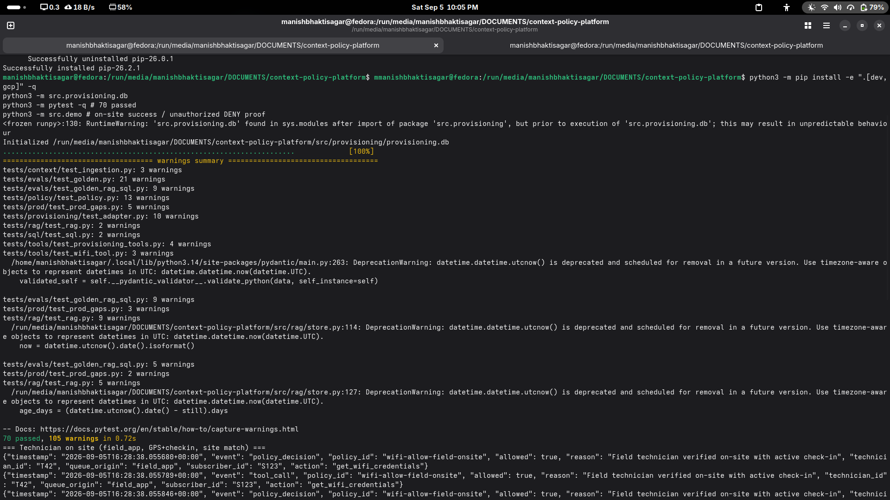
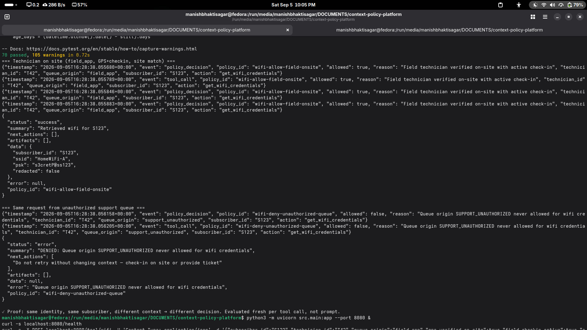
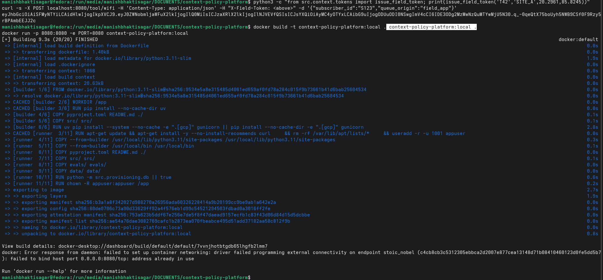

# ISP Context-Aware Policy Platform

> From scratch build — policy-first, not prompt-first.

Same request, different context:
- `technician_id=T42, queue=field_app, gps=site_A, checkin=true` → `get_wifi_credentials(subscriber=S123)` → **ALLOW**
- `technician_id=T42, queue=support_unauth, checkin=false` → same → **DENY**

Authorization evaluated fresh on every tool call from `identity + context`, not baked into prompt or permission table.

## Architecture (request-time, not static)

```
[Field App GPS/check-in] ─┐
[Queue routing metadata] ─┤
[Ticket ID / Subscriber] ─┼─► Context/Identity Ingestion (trusted signals, not LLM inference)
                          │
                          ▼
                    ┌─────────────┐
                    │ Policy Engine│  evaluate(identity, context, action, resource) -> allow/deny/redact
                    │ (predicate /│  fires EVERY tool call  ┌─────────────────────┐
                    │  OPA/Rego)  │◄────────────────────────│ Agent Router        │
                    └──────┬──────┘                         │ (intent → tool)     │
                           │ allow?                         └──────────┬──────────┘
              ┌────────────┼────────────┐                                 │
              ▼            ▼            ▼                                  │
   ┌────────────────┐ ┌─────────┐ ┌──────────┐                             │
   │ Legacy Adapter │ │ RAG     │ │Text2SQL  │  ← all sit BEHIND policy    │
   │ (2009 system)  │ │(2011 PDFs│ │(undoc'd  │                             │
   │ 4-5 fn, 2nd   │ │ staleness│ │ semantic │                             │
   │ auth check)   │ │ metadata)│ │ layer)   │                             │
   └────────────────┘ └─────────┘ └──────────┘                             │
                                                                           │
                    ┌──────────────────────────────────────────────────────┘
                    │  Evals in CI — golden set (context, query, expected) FAILS build on auth flip
                    └──────────────────────────────────────────────────────
```

## Skills Applied

**ECC:**
- `eval-harness` — golden evals defined BEFORE code, code-grader + pass^3=100% for auth
- `agent-harness-construction` — typed micro-tools, deterministic observation shapes, error recovery
- `backend-patterns` — service/adapter, repository, middleware auth
- `ai-regression-testing` — sandbox vs prod parity, SELECT omission prevention
- `safety-guard / gateguard` — double auth check at adapter, not just prompt

**Matt Skills:**
- `tdd` — red→green at pre-agreed seams (policy.evaluate, adapter.get_wifi), vertical slices
- `prototype` — throwaway HTML to sanity-check policy state machine before committing
- `implement` — typecheck + full suite after each slice

## Build Order (strict)

1. Mock provisioning — `src/provisioning/` SQLite + awkward protocol wrapper
2. Policy engine — `src/policy/` predicate, tests for on-site vs unauthorized queue
3. Wire — `src/tools/` agent tool that calls policy THEN adapter
4. Evals in CI — `evals/golden.jsonl` + `pytest tests/evals/` + GitHub Action fail on auth miss
5. RAG + Text-to-SQL — reuse same harness

## Quickstart (local)

```bash
python -m venv .venv && source .venv/bin/activate
pip install -e ".[dev]"
pytest -q                         # 39 tests: wifi, RAG staleness, SQL guardrails
pytest tests/evals -v             # golden 100% gate (pass^3=1.0)
python -m src.demo                # manual: on-site ALLOW vs unauthorized DENY
# or HTTP (Cloud Run locally):
pip install -e ".[gcp]" && ./scripts/local_run.sh
```

## Deploy to GCP (Python on GCP)

```bash
export PROJECT_ID=your-gcp-project
export REGION=asia-south1  # Bhubaneswar close
# Cloud Build + Cloud Run (eval gate runs in build):
gcloud builds submit --config cloudbuild.yaml
# or Terraform:
cd infra/terraform && terraform init && terraform apply -var="project_id=$PROJECT_ID" -var="image=gcr.io/$PROJECT_ID/context-policy-platform:$(git rev-parse --short HEAD)"
# or one-liner:
./scripts/deploy.sh
```

Endpoints: `GET /health`, `POST /tool/wifi`, `/tool/line-status`, `/tool/docs`, `/tool/sql` — all policy-guarded per-call, adapter double-checked, same `src/policy/engine.py:15` as local.

## Repo Layout

```
src/
  provisioning/  # 2009 system mock + awkward wrapper
  policy/        # predicate engine
  tools/         # agent-callable tools (policy-guarded)
  context/       # ingestion from trusted systems
  rag/           # 2011 PDFs + staleness (step 5)
  sql/           # undocumented schema + semantic layer (step 5)
  agent/         # router (fun 20%, smallest layer)
evals/
  golden.jsonl   # (context, query, expected_action) pairs
tests/
  provisioning/
  policy/
  evals/
docs/
  adr/
```

## The One Bulletproof Guarantee

```
policy.evaluate(identity, context, action, resource)
  is called INSIDE every tool impl, not in system prompt,
  not at session start, not in a permission table.
Adapter re-checks independently. Bypass one layer ≠ bypass.
```

## Local Run Screenshots

Verified locally 2026-09-05 — 70 passed, allow/deny proof, Docker build:




